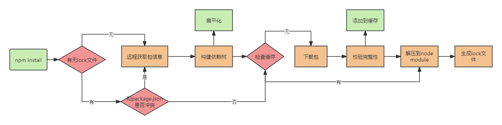

# 包管理
## 包管理工具

### npm
npm的全称是`Node Package Manager`，是随同`NodeJS`一起安装的包管理和分发工具，它很方便让`JavaScript`开发者下载、安装、上传以及管理已经安装的包。其常用指令如下：

| npm命令                            | 备注解释                                                    |
|:---------------------------------|:--------------------------------------------------------|
| npm i \<pkg\>                    | 安装package包,等价于npm install \<pkg\><br/>默认安装package包的最新版本 |
| npm i \<pkg\> -g                 | 全局安装                                                    |
| npm i \<pkg\> -dev               | 安装到开发环境                                                 |
| npm i \<pkg\> @version           | 安装指定版本的包                                                |
| npm i \<pkg\> @version "\>a \<b" | 安装a~b之间的版本                                              |
| npm uninstall \<pkg\>            | 卸载指定包                                                   |
| npm update \<pkg\>               | 更新指定包                                                   |
| npm run 命令                       | 运行package.json中指定的script脚本                              |
| npm config set registry url      | 设置指定的下载源                                                |
### pnpm

## 配置文件
### package.json
用来描述项目以及项目所依赖的模块信息
#### 生成
``` shell
# 创建时填写信息
npm init  

# 所有信息使用默认的
npm init -y
```
#### 常见配置说明
> 依赖集中的版本号，都是依据[SemVer](https://semver.org/lang/zh-CN/)版本规范的
``` json
{
    "name": "", // 项目名称
    "version": "", // 项目版本
    "private": "", // 是否私有
    "description": "", // 项目描述
    "author": "", // 作者
    "license": "", // 开源协议
    "main": "", // 设置程序入口
    "script": {}, // 脚本命令

    "dependencies": {
        "vue": "*x.y.z", // *表示匹配 *.*.* 版本 其中*表示最新
        "vue": "^x.y.z", // ^表示匹配 x.*.* 版本
        "vue": "~x.y.z", // ~表示匹配 x.y.* 版本
        "vue": "x.y.z", // 固定版本号为 x.y.z
    }, // 依赖集
    "devDependencies": {
        "webpack": "版本号",
        "babel": "版本号",
        "loader": "版本号",
        "...": "...",
    }, // 开发依赖集
    "peerDependencies": {
        "vue3": "版本号", // 比如element-plus的对等依赖集-vue
        "...": "...",
    }, // 对等依赖集，依赖的这个包，它必须是以另外一个宿主为前提
}
```
### lock文件
`lock`文件的作用是确保在不同机器上或在不同时间安装相同的依赖包时，获得相同的版本，以避免由于版本不一致而产生的问题。在安装依赖包时，`lock`文件会锁定当前的依赖树，并记录每个依赖包的确切版本号和依赖关系。这样，在重新安装依赖包时，将使用`lock`文件中记录的版本和依赖关系来安装依赖包，而不是根据`package.json`文件中的符号依赖去解析版本。这确保了依赖包版本的一致性。

## 相关知识点
:::info `npm install` 的原理？


+ 检查项目中有无 lock 文件
  + 无lock文件
    1. 从npm远程仓库获取包信息
    2. 根据package.json构建依赖树，构建过程
       + 构建依赖树时，不管其是直接依赖还是子依赖的依赖，优先将其放置在 node_modules 根目录。
       + 当遇到相同模块时，判断已放置在依赖树的模块版本是否符合新模块的版本范围，如果符合则跳过，不符合则在当前模块的 node_modules 下放置该模块。
       + 注意这一步只是确定逻辑上的依赖树，并非真正的安装，后面会根据这个依赖结构去下载或拿到缓存中的依赖包
    3. 在缓存中依次查找依赖树中的每个包
        + 存在缓存: 将缓存按照依赖结构解压到 node_modules
        + 不存在缓存
          1. 从 npm 远程仓库下载包 
          2. 校验包的完整性
             + 校验不通过则重新下载包
             + 校验通过
               - 将下载的包复制到 npm 缓存目录
               - 将下载的包按照依赖结构解压到 node_modules
    4. 将包解压到 node_modules
    5. 生成 lock 文件
  + 有lock文件
    1. 检查 package.json 中的依赖版本是否和 package-lock.json 中的依赖有冲突。
    2. 如果没有冲突，直接跳过获取包信息、构建依赖树过程，开始在缓存中查找包信息，后续过程相同

:::

:::info 为什么不直接在`package.json`中固定版本号，而是在`lock`文件中？ 
`package.josn`虽然可以固定版本号，但`package.json`中依赖库所依赖的库并不是按照固定版本号进行迭代的。一旦依赖库所依赖的库有所升级，在没有lock的情况下，就会被更新到最新。无法保证更新后的依赖对`package.json`中固定版本号的依赖仍然兼容。

一句话总结就是：需要保证多人开发时，依赖库的依赖库版本一致
:::