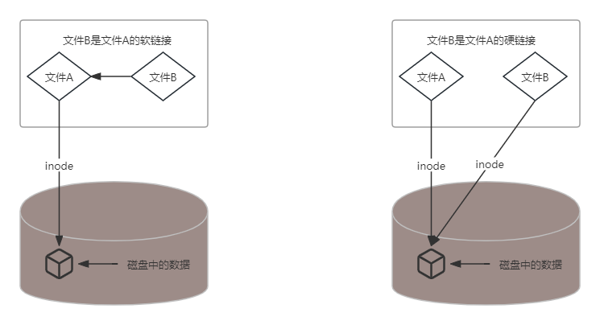

# 软链接和硬链接
硬链接和软链接是在硬盘中链接文件的两种方法。

## inode
要理解硬链接和软链接的不同，首先要了解`inode`。

储存文件元信息(比如文件的创建者、文件的创建日期、文件的大小等等)的区域就叫做`inode`，中文译名为"索引节点"。每个文件都有一个`inode`。
## 硬链接
硬链接（`hard link`）就是一个文件的一个或多个文件名。把文件名和计算机文件系统使用的`inode`链接起来。 
+ 可以用不同的文件名访问同样的内容
+ 对文件内容进行修改，会影响到所有文件名
+ 删除一个文件名，不影响另一个文件名的访问
  > 删除一个文件名，就会使得inode节点中的"链接数"减1。当这个值减到0，表明没有文件名指向这个`inode`，系统就会回收这个`inode`号码，以及其所对应`block`区域。

这种情况就被称为"硬链接"（hard link）。

## 软链接
文件A和文件B的`inode`号码不一样，文件A的内容是文件B的`路径`。读取文件A时，系统会自动将访问者导向文件B。因此，无论打开哪一个文件，最终读取的都是文件B。这时，文件A就称为文件B的"软链接"（`soft link`）或者"符号链接（`symbolic link`）。

+ 文件A依赖于文件B而存在
+ 删除了文件B，打开文件A就会报错。
+ 文件A指向文件B的文件名，而不是文件B的inode号码，文件B的`inode`链接数不会因此发生变化。